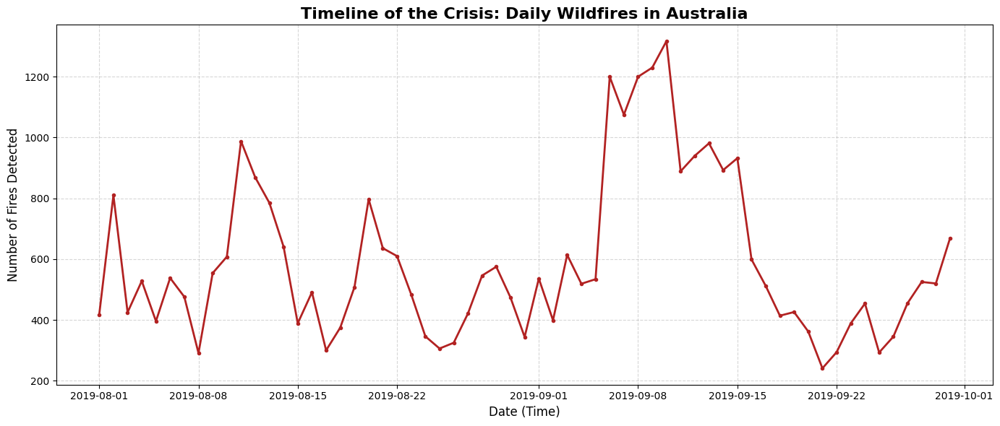

# Australia Wildfire Spatial Analysis 🌍🔥

## Overview
This project visualizes the severe 2019-2020 Australian wildfires using NASA's satellite dataset. The main goal is to analyze the spatial distribution and temporal evolution of the fires to better understand the scale and intensity of this natural disaster.

## Features & Visualizations
- **Macro View Map:** A scatter plot revealing the shape of Australia purely through fire hotspots based on latitude and longitude.
- **Interactive Heatmap:** A web-based map built with `Folium` that allows users to zoom in and check the Brightness and Fire Radiative Power (FRP) of the most severe fires.
- **Time-Series Analysis:** A timeline chart tracking the daily number of fires to identify the exact peak of the crisis.

## Tech Stack
- **Language:** Python
- **Libraries:** Pandas (Data manipulation), Matplotlib (Static data visualization), Folium (Interactive mapping)

## How to Run
1. Clone this repository.
2. Ensure you have the required libraries installed (`pip install pandas matplotlib folium`).
3. Run the Jupyter Notebook to generate the static charts and the interactive `Premium_Wildfire_Map.html` file.

## Timeline Analysis

